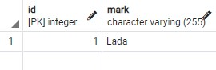
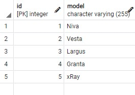
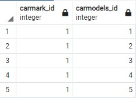

<h1>3. Мидл</h1>
<h2>3.3. Hibernate</h2> 
<h3>3.3.2. Mapping</h3>
<h3>1. ToMany [#301848]</h3>

Задание  

1. Создайте модели данных Модель автомобиля и Марка автомобиля.  
   Каждая из моделей имеет 2 поля: id и name.  

2. По аналогии с описанием организуйте связь OneToMany:  
   одна марка - много моделей. Важно - мы рассматриваем Unidirectional связь,  
   поэтому аннотация, которая определяет связь между сущностями будет только в одном классе.  

3. Напишите код сохранения сущностей в БД.  
   Добавьте 1 марку и связанные с ней 5 моделей.  

Созданы две модели данных:  
CarMark марка автомобиля.  
CarModel модели автомобилей.  
Скрипты создания таблиц расположены в db/scrip  
c_mark.sql таблица марок автомобилей.  
с_model.sql таблица моделей автомобилей.  

Класс содержащий метод main и в котором содержится создание и наполнение таблиц:  
HibernateApp.  

Результат заполнения таблицы c_mark  

Результат заполнения таблицы c_model  

Результат генерации таблицы c_mark_c_model  

### Контакты

> email: [haoos@inbox.ru](mailto:haoos@inbox.ru)  
> tl: [Dima_software](https://t.me/Dima_software)  
> github.com: [Dima-Stepanov](https://github.com/Dima-Stepanov)
